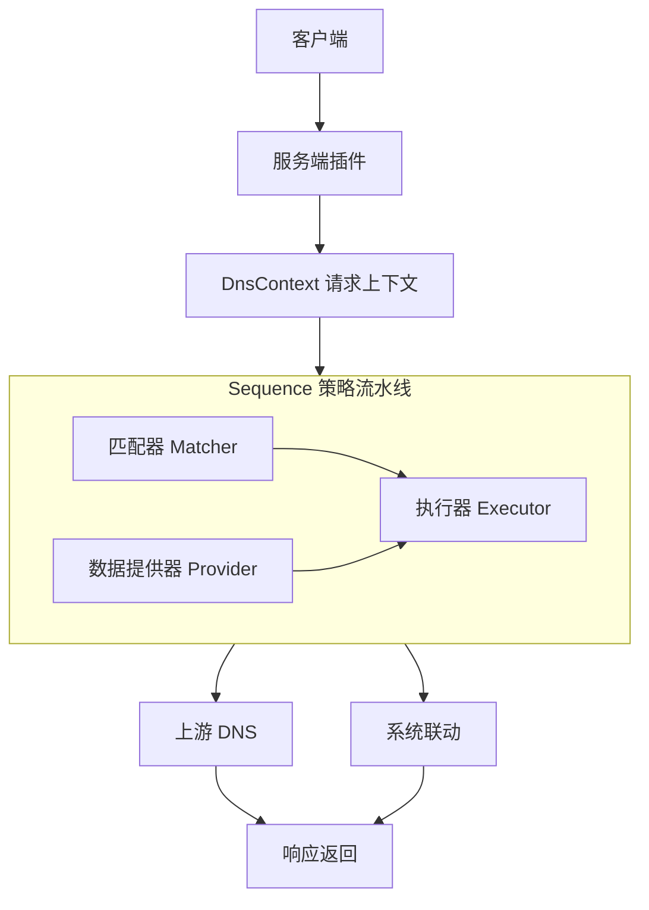

本页说明 OxiDNS Next 的请求路径、插件分层和性能边界，用于辅助配置设计、策略组合和问题排查。

## 核心请求路径

OxiDNS Next 围绕下面这条主路径工作：

`server -> DnsContext -> matcher / executor / provider -> upstream or side effects -> response`

对应职责如下：

* `server`：负责接入 UDP、TCP、DoT、DoQ、DoH
* `DnsContext`：承载一次请求处理过程中的查询、响应和附加属性
* `matcher`：判断条件是否命中
* `executor`：执行缓存、转发、回退、重写、本地应答等动作
* `provider`：提供可复用的 domain/ip 数据集

## 为什么这样分层

OxiDNS Next 不把复杂行为散落在监听器或 transport 分支里，而是尽量统一收敛到策略层。这样做有几个直接收益：

* 请求主路径更短，更容易优化
* 功能组合更自然，不需要为每个协议写一套特殊逻辑
* 新能力更适合以插件形式演进，而不是污染核心流程
* 配置表达更稳定，用户更容易理解策略执行顺序

## 设计重点

### 1. 性能先于功能堆叠

项目更看重“复杂策略下仍然可控”，而不是“简单路径下堆很多开关”。因此会优先做这些事情：

* 缩短热路径
* 减少每请求重复工作
* 复用上游连接和协议状态
* 把观测与副作用尽量移出最敏感响应路径

### 2. 策略是第一等能力

OxiDNS Next 的核心不是单一 forwarder，而是一个可编排的策略系统。`sequence` 负责组织执行顺序，`matcher` 决定命中条件，`executor` 负责动作，`provider` 负责共享数据。

这种结构比把规则硬编码在监听器或上游模块里更容易维护，也更适合长期扩展。

### 3. 系统联动是架构内能力

OxiDNS Next 不把 DNS 只看作“收到请求然后返回响应”。解析结果还可以驱动 `ipset`、`nftset`、MikroTik 路由同步、反向缓存等系统行为，因此请求路径设计时就考虑了副作用隔离和 post-stage 执行。

## 自研消息层的原因

OxiDNS Next 使用自己的 DNS 消息模型和 wire 编解码层，而不是把整条数据路径都建立在第三方消息对象之上。主要原因有三点：

* 更容易围绕实际热点做定向优化
* 更方便让策略层直接读写消息语义
* 更容易把协议正确性和服务端行为放在同一套代码里维护

当前可以简单理解为两层：

* model 层：`Message`、`Name`、`Record`、`RData`
* wire 层：`message/wire` 下的编解码、压缩、长度估算、截断和 RDATA 规则

## 性能设计原则

OxiDNS Next 当前的性能思路可以概括为：

1. 监听器尽量薄，策略统一进入 `sequence`
2. 能在初始化完成的工作，不放到每个请求里重复做
3. 上游连接是可复用资源，不是一次性耗材
4. 日志、指标、路由同步等副作用尽量离开主响应路径
5. 缓存不仅要快，还要尊重 TTL 与负缓存语义
6. 控制锁竞争和共享状态膨胀
