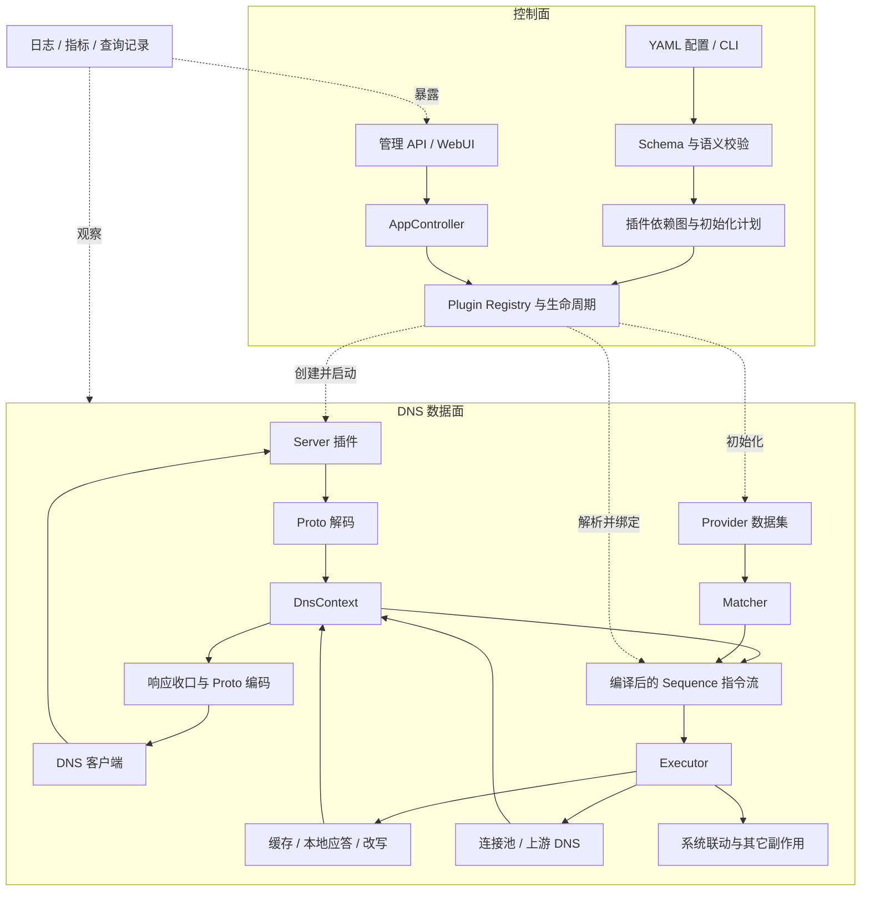

OxiDNS Next 是一个面向复杂网络的 DNS 策略编排引擎。它不是把协议、缓存、转发和规则判断堆在同一个处理函数中，而是将数据面、控制面、策略层和基础设施层分开，再通过统一的请求上下文连接起来。

这一章以当前仓库实现为准，回答四个问题：一次查询如何流经系统、各模块为什么这样划分、性能优化落在什么位置，以及 OxiDNS Next 最有辨识度的能力是什么。

## 架构目标

OxiDNS Next 的架构围绕以下目标设计：

- **协议与策略解耦**：UDP、TCP、DoT、DoQ、DoH 接入后进入同一条策略管线。
- **复杂策略可组合**：匹配、执行、共享数据集和控制流分别建模，而不是写成协议分支。
- **热路径可优化**：配置解析、依赖分析、策略编译和连接建立尽可能前移到初始化阶段。
- **DNS 语义优先**：缓存、并发上游、截断和负向响应不仅追求速度，也要保持协议正确性。
- **运行过程可解释**：配置图、执行轨迹、日志、指标、健康检查和构建能力共同构成可观测面。
- **副作用可治理**：路由表、地址集合、下载、脚本等系统行为与 DNS 响应生成保持清晰边界。

## 架构全景

项目分为数据面和控制面。数据面处理每个 DNS 请求；控制面负责配置、生命周期、管理 API 和观测。两者共享运行时状态，但不会让 HTTP API 或服务管理逻辑进入 DNS 策略热路径。

```mermaid
flowchart TB
    subgraph CP[控制面]
        CFG[YAML 配置 / CLI] --> VALID[Schema 与语义校验]
        VALID --> GRAPH[插件依赖图与初始化计划]
        GRAPH --> REG[Plugin Registry 与生命周期]
        API[管理 API / WebUI] --> APP[AppController]
        APP --> REG
    end

    subgraph DP[DNS 数据面]
        CLIENT[DNS 客户端] --> SERVER[Server 插件]
        SERVER --> CODEC[Proto 解码]
        CODEC --> CTX[DnsContext]
        CTX --> PROGRAM[编译后的 Sequence 指令流]
        PROVIDER[Provider 数据集] --> MATCHER[Matcher]
        MATCHER --> PROGRAM
        PROGRAM --> EXEC[Executor]
        EXEC --> LOCAL[缓存 / 本地应答 / 改写]
        EXEC --> UPSTREAM[连接池 / 上游 DNS]
        EXEC --> EFFECT[系统联动与其它副作用]
        LOCAL --> CTX
        UPSTREAM --> CTX
        CTX --> FINALIZE[响应收口与 Proto 编码]
        FINALIZE --> CLIENT
    end

    REG -. 创建并启动 .-> SERVER
    REG -. 解析并绑定 .-> PROGRAM
    REG -. 初始化 .-> PROVIDER
    OBS[日志 / 指标 / 查询记录] -. 观察 .-> DP
    OBS -. 暴露 .-> API
```

核心数据路径可以压缩成一句话：

`server -> DnsContext -> compiled sequence -> matcher / executor / provider -> response or side effects`

## 一次 DNS 请求如何执行

### 1. 协议接入与消息解码

`src/plugin/server/` 负责 UDP、TCP、DoT、DoQ 和 HTTP DNS 接入。Server 插件只处理监听、连接、协议元数据和收发，不承载具体分流策略。DNS wire 数据由独立的 `crates/proto` 解码为项目自己的 `Message`。

不同协议最终都调用统一的 `RequestHandle`。因此新增 matcher、cache 或 rewrite 行为时，不需要分别修改 UDP、QUIC 和 HTTP 服务端。

### 2. 建立统一的 `DnsContext`

每个请求都会创建一个 `DnsContext`，它是策略层唯一需要理解的请求生命周期对象。

| 区域 | 内容 | 用途 |
| --- | --- | --- |
| `ingress` | 客户端地址、SNI/服务名、HTTP URL path | 传递接入层元数据 |
| `request` | 当前 DNS 请求消息 | 供 matcher 读取、executor 改写 |
| `response` | 可选 DNS 响应消息 | 由缓存、上游或本地应答产生 |
| `runtime` | marks 与类型安全的请求级扩展数据 | 在插件之间传递临时状态 |
| `execution_path` | 可选的结构化执行事件 | 查询记录和策略诊断 |

状态只在当前请求内流动，避免将请求级信息塞入全局共享对象。

### 3. 进入编译后的策略程序

Server 的 `entry` 指向一个 executor，通常是 `sequence`。Sequence 并不会在每个请求到来时重新解析 YAML；它在插件初始化时完成以下工作：

- 将 `$plugin_tag` 和 quick setup 表达式解析为实际插件引用；
- 将 matcher 列表和 executor 绑定到指令；
- 将 `accept`、`return`、`reject`、`jump`、`goto`、`mark` 编译为内置操作；
- 生成由 program counter 驱动的扁平 `ChainProgram`。

请求阶段只需顺序读取指令、执行 matcher 并根据 `ExecStep::Next / Stop / Return` 推进控制流。需要包裹下游执行的插件可以使用 continuation 模型，在下游前后执行逻辑；cache、fallback 等能力因此可以组合，而不需要第二套特殊管线。

### 4. 产生响应或执行副作用

Executor 可能：

- 从 cache、hosts、arbitrary 或 response 直接生成响应；
- 通过 forward 查询一个或多个上游；
- 修改请求、EDNS/ECS、TTL、响应记录或 mark；
- 触发 `ipset`、`nftset`、MikroTik、HTTP 请求、脚本或记录等副作用；
- 继续、停止当前 sequence，或返回调用方 sequence。

Provider 不参与网络接入，它提供可复用的 domain/IP/Geo/AdGuard 数据集，供 matcher 或 executor 共享，避免每条规则重复加载同一份数据。

### 5. 统一收口响应

`RequestHandle` 对所有协议使用相同的错误和响应收口逻辑：

- executor 出错时生成 `SERVFAIL`；
- 策略自然结束但没有响应时生成空的 `NOERROR`；
- 统一设置 recursion available，并在请求携带 EDNS 时补齐响应 EDNS；
- UDP 发送按照 payload limit 编码和截断，TCP/加密协议使用各自 framing。

这样，策略插件不需要重复实现服务端级协议兜底。

## 插件模型

OxiDNS Next 有四类插件，分类代表生命周期和依赖语义，而不只是目录名称。

| 类别 | 职责 | 典型实现 |
| --- | --- | --- |
| `server` | 接入协议并把请求交给 entry executor | `udp_server`、`tcp_server`、`quic_server`、`http_server` |
| `executor` | 读取或修改上下文、产生响应、控制流程或执行副作用 | `sequence`、`forward`、`cache`、`fallback`、`ttl` |
| `matcher` | 对请求、响应、客户端和运行状态做谓词判断 | `qname`、`client_ip`、`resp_ip`、`rcode`、`rate_limiter` |
| `provider` | 加载并维护可复用规则数据 | `domain_set`、`ip_set`、`geoip`、`geosite`、`adguard_rule` |

工厂通过 proc-macro 和 `inventory` 注册，核心 registry 不需要维护一个不断增长的手写类型分发表。每个工厂同时声明依赖，配置检查和运行时初始化因此使用同一套插件目录与依赖语义。

### 依赖图与生命周期

启动不是“按 YAML 顺序逐个 new”：

1. 检查重复 tag 和未知插件类型。
2. 分析插件引用，拒绝缺失依赖、类型不匹配、自引用和依赖环。
3. 从非 Provider 插件反向计算 live set，跳过没有使用者的 Provider。
4. 按配置顺序执行 startup preparation，例如先下载 Provider 需要的文件。
5. 按拓扑顺序创建、初始化并发布插件实例。
6. 关闭时按初始化顺序逆序销毁，保证依赖方先于被依赖方退出。

这套机制让错误尽量在监听端口开放前暴露，也让插件可以依赖抽象能力，而不是依赖“配置刚好写在前面”。

## 代码模块边界

| 模块 | 主要职责 | 不应承担的职责 |
| --- | --- | --- |
| `src/main.rs` | 二进制入口和顶层命令分发 | 插件业务与网络实现 |
| `src/cli/` | CLI 参数、输出与运行时适配 | DNS 请求处理 |
| `src/app/` | 启动、reload、rollback、restart、graceful shutdown 编排 | 具体插件逻辑 |
| `src/config/` | YAML、include、环境变量展开、强类型 schema 与校验 | 创建网络连接 |
| `src/api/` | 管理、健康、控制、日志、指标和插件 HTTP 路由 | 数据面策略决策 |
| `src/core/` | `DnsContext`、响应分类和通用规则匹配原语 | I/O 与插件注册 |
| `src/plugin/` | 四类插件、工厂、依赖图、registry 与类别内共享实现 | 通用网络和系统基础设施 |
| `src/infra/` | 网络、缓存原语、任务中心、观测、服务、升级和通用 I/O | matcher/executor/provider 语义 |
| `crates/proto/` | DNS model、RDATA 与 wire codec | 运行时策略 |
| `crates/macros/` | 插件注册 proc-macro | 运行时状态 |
| `crates/ripset/` | Linux ipset/nftset netlink 实现 | DNS 策略编排 |
| `crates/zoneparser/` | zone 文件解析 | 插件生命周期 |

关键依赖方向是 `plugin -> core / infra / proto`。只有不含插件语义、能被多个子系统复用的能力才进入 `infra`；插件 trait、注册表和专用模型不会反向下沉到基础设施层。

## 网络与上游架构

### 入站与出站分离

入站 Server 负责“如何接收查询”，Upstream 负责“如何发出查询”，两者共享 message 与 transport 基础设施，但配置和生命周期独立。`network.outbound` 进一步统一进程主动访问外部服务时使用的 resolver 和 SOCKS5 策略，避免下载、升级、HTTP side effect 和 DNS upstream 各自实现一套出站规则。

协议 feature 也按责任拆分：

- `server-*`：入站 DoT/DoH/DoQ/DoH3；
- `upstream-*`：forward 等 DNS upstream；
- `resolver-*`：`network.outbound.resolver.nameservers`。

### 两种连接池

网络层根据协议能力选择连接复用模型：

| 模型 | 适用路径 | 实现重点 |
| --- | --- | --- |
| Pipeline pool | UDP、DoQ、DoH2/3，以及显式开启 pipeline 的 TCP/DoT | 单连接多请求、原子 inflight 计数、`ArcSwap` 连接快照、按负载选槽 |
| Reuse pool | 默认 TCP/DoT、UDP 截断后的 TCP fallback | 一次借用处理一个请求、`ArrayQueue` 归还连接、限制连接总数 |

两种池都支持最小/最大连接数、空闲清理、按需扩容和后台预热。一个 `QueryDeadline` 贯穿获取连接、建连和查询等待，超时后根据协议安全性选择复用、退役或关闭连接，避免每一层重新开始完整 timeout。

Pipeline 连接使用按预期并发量定容的稀疏 request map，只保存活跃 DNS ID 与 waiter，而不是为每条连接分配完整的 65,536 ID 表。其槽位状态由原子操作管理，请求完成或取消时通过 RAII guard 清理。

UDP 上游如果收到 TC 响应，会在同一个 deadline 预算内自动转到 TCP fallback pool。域名形式的上游则通过 bootstrap resolver 获取带 TTL 的地址；地址变化时刷新连接池，而不是每次请求都重新解析和建连。

### 并发上游不是简单的“最快返回”

`forward` 支持同时查询多个上游，但结果选择会区分正向答案、NXDOMAIN、NODATA、不完整 CNAME 链和其它响应。当前提供：

- `fastest`：第一个有效 DNS 响应获胜；
- `balanced`：正向答案立即返回，负向答案保留短暂等待窗口；
- `prefer_positive`：等待其它请求，优先选择正向答案；
- `consensus`：负向答案需要同类结果达到确认票数。

这解决了并发 DNS 常见的问题：最快的负向结果不一定是最可信的结果。

## 自研 DNS 消息层

`crates/proto` 是独立 crate，拥有 `Message`、`Name`、`Record`、`RData` 以及 wire codec。自研消息层的价值不只是“少一个依赖”，而是让协议语义和热路径优化可以一起演进：

- `Name` 使用 `Arc` 共享不可变内部数据，并用 `SmallVec` 优化常见短域名和 label offset；
- EDNS 等结构使用 copy-on-write，克隆消息时不必立即深拷贝全部内容；
- 编码器可直接 append 到复用 buffer，支持覆盖 wire ID、域名压缩、长度估算和 payload limit；
- UDP 限长编码按 RR 边界回退并设置 TC，同时保持 EDNS trailer 和压缩规则正确；
- decoder 对压缩指针越界、循环和过深跳转做显式防护。

代价是项目必须自己维护更多 DNS 类型和兼容性测试，因此 `proto` 与策略层保持独立，避免协议维护风险扩散到插件代码。

## Cache 架构

Cache executor 建立在 `src/infra/cache/ttl.rs` 的通用并发 TTL cache 上，但 DNS 语义保留在插件层。

### 正确性

- key 包含规范化 qname、qtype、qclass、DO、CD，并可选择包含截断到 prefix 的 ECS scope；
- 正向缓存使用答案 TTL，并支持最大/最小 TTL 策略；
- NXDOMAIN/NODATA 使用 SOA 推导负缓存 TTL，没有 SOA 时使用可配置 fallback；
- 不缓存 TC 响应和不完整 alias 答案；
- 命中后恢复原请求 ID，并按照已经流逝的时间调整记录 TTL。

### 并发与容量

- `DashMap + AHash` 将读写分散到多个 shard；
- 命中时不会每次都更新 LRU 时间戳，而是根据容量和占用率自适应 touch interval；
- 过期扫描、sampled LRU 和高低水位批量淘汰避免在单次请求里全表排序；
- 大部分清理由统一 TaskCenter 调度，写入路径只做有上限的 inline maintenance。

### Lazy cache 与持久化

启用 lazy cache 后，条目可以在 fresh TTL 结束后作为 stale 响应短暂服务，同时由后台 continuation 刷新。相同 key 的刷新通过 inflight set 去重，并在写回前核对条目身份，避免旧刷新覆盖新值。

可选 dump 文件在启动时恢复，并按照变更阈值和周期异步写出。持久化是可恢复能力，不进入普通 cache hit 的关键路径。

## 性能优化落点

OxiDNS Next 的性能优化不是集中在某个“高性能模块”，而是沿请求生命周期分布。

| 层次 | 当前实现 | 主要收益 |
| --- | --- | --- |
| 策略 | Sequence 初始化时编译为扁平指令流 | 避免每请求解析表达式和查找控制流 |
| 消息 | `Arc`、copy-on-write、`SmallVec`、直接 append 编码 | 降低消息 clone 和短对象分配成本 |
| UDP I/O | 全局固定容量 wire buffer pool，RAII 自动归还 | 减少短生命周期 `Vec` 分配 |
| TCP I/O | reader/writer 持有可复用帧缓冲；明文 TCP 使用 owned halves | 减少扩容，并避免不必要的共享 I/O 锁 |
| 连接池 | Pipeline 使用 `ArcSwap + atomics`，Reuse 使用 `ArrayQueue` | 降低连接选择和归还时的锁竞争 |
| 请求关联 | 有界稀疏 lock-free request map | 在保留完整 DNS ID 空间时控制单连接内存 |
| Cache | 分片 map、自适应 touch、批量过期清理和 sampled LRU | 控制高命中率下的写放大和长尾暂停 |
| 调度 | 一个 TaskCenter 用 deadline heap 管理周期任务 | 减少每个插件独立 ticker 带来的常驻 task 开销 |
| 观测 | 原子计数、按需采集；debug 日志先检查 level | 避免关闭详细观测时仍支付格式化成本 |
| 构建 | Cargo feature 裁剪协议、API 和可选插件 | 在小设备上减少二进制、依赖和运行面 |

项目还提供 `hotpath` 和 `hotpath-alloc` feature，用于定位函数耗时和分配，而不是依赖直觉决定优化方向。真实性能结论、测试方法和历史数据见[性能与基准](benchmarks.md)。

## 当前项目最有辨识度的能力

### 1. 策略编排深度

OxiDNS Next 的核心优势不是插件数量，而是 matcher、executor、provider、sequence、quick setup、jump/goto 和 continuation 形成了一套完整执行模型。同一能力可以作为独立插件复用，也可以在复杂策略里组合，而不会把监听协议变成业务逻辑入口。

### 2. 对 DNS 结果语义的重视

Cache、fallback、并发 forward 和 resolver 共用响应分类思路，显式区分正向答案、负向答案、空答案和不完整 CNAME。TTL、SOA、EDNS、ECS、TC 和请求 ID 都作为正确性约束处理，而不是只缓存或返回“最先收到的 Message”。

### 3. 协议覆盖与连接管理同时完整

项目同时覆盖传统 UDP/TCP、DoT、DoH2、DoH3 和 DoQ，并为 bootstrap、代理、连接池、pipeline、deadline、UDP-to-TCP fallback 和 resolver cache 建立了统一基础设施。协议支持不是若干孤立 client 的集合。

### 4. DNS 与网络系统联动

解析结果可以驱动 `ipset`、`nftset`、MikroTik 地址列表/路由、反向查询缓存和动态域名集合。RouterOS 公共部分还包含 batching、throttle、lease、reconcile 和 mailbox 等基础组件，使外部系统同步具备生命周期和背压意识，而不是在请求函数里直接调用一次远程 API。

### 5. 可操作、可诊断的运行时

项目提供配置静态检查、依赖图、健康/就绪接口、构建能力接口、Prometheus 指标、实时日志、查询摘要、查询记录、Provider reload、全量 reload、restart 和 upgrade。复杂策略出问题时，维护者可以从配置、执行路径、插件指标和进程状态多个层面定位。

### 6. 可裁剪而不是维护多个产品分支

`minimal`、`standard`、`full` 和 granular features 共用同一代码库。小型路由器可以去掉 API、WebUI、加密协议或重插件，完整部署则保留全部能力；feature gating 测试确保未编译能力产生明确错误，而不是运行到某个深层分支才失败。详见[自定义编译](custom-build.mdx)。

## 控制面、Reload 与故障边界

控制面由 `AppController`、可选管理 API 和应用事件循环组成。API 发出 reload/restart/shutdown 命令，真正的生命周期变更仍由 `src/app/` 串行执行，从而避免 HTTP handler 直接并发修改全局 runtime。

配置加载会处理 include、YAML 反序列化、环境变量展开、schema 校验和依赖分析。全量 reload 的当前流程是：

1. 先验证候选配置；验证失败时保持当前 runtime 不动。
2. 停止旧 API 与插件 runtime，并停止统一 TaskCenter 中的任务。
3. 使用候选配置重新 assemble。
4. 如果 assemble 失败，使用保存的旧配置重新构建 runtime。

因此，全量 reload 具备失败恢复能力，但不是严格意义上的零停机切换，重建窗口内可能有短暂服务中断。只更新规则数据时应优先使用 Provider 级 reload，它不会销毁整个插件图。

## 设计边界与取舍

- **可组合性带来配置复杂度**：策略越复杂，越需要使用配置检查、依赖图和执行记录，而不是仅靠阅读 YAML 推断结果。
- **并发上游会放大流量**：`concurrent` 用延迟和可靠性换取额外查询量，应结合上游限制选择 selection mode 和并发度。
- **副作用必须显式放置**：脚本、HTTP 请求、路由同步和持久化可能阻塞或失败。能异步投递的操作应使用 mailbox/后台任务；continuation 可以在下游策略完成后执行清理或提交，但它仍发生在 wire response 发出前，不能被当成天然的异步隔离。
- **自研协议层需要持续验证**：它提供优化和控制空间，也意味着新增 RR 类型、压缩规则和边界行为必须配套测试。
- **feature 裁剪改变运行能力**：配置必须与二进制实际 feature/plugin catalog 一致，可通过 `oxidns-next build-info` 或 `/api/build` 辅助核对。

这些边界不是架构缺陷的掩饰，而是部署和继续演进时需要明确管理的成本。

## 延伸阅读

- [插件总览](plugin-reference/overview.md)：四类插件和选择入口
- [配置总览](configuration.md)：运行时 schema 与网络配置
- [管理 API](api.mdx)：控制面、健康检查和指标
- [性能与基准](benchmarks.md)：可复现的性能数据与分析方法
- [自定义编译](custom-build.mdx)：bundle 与 feature 裁剪
