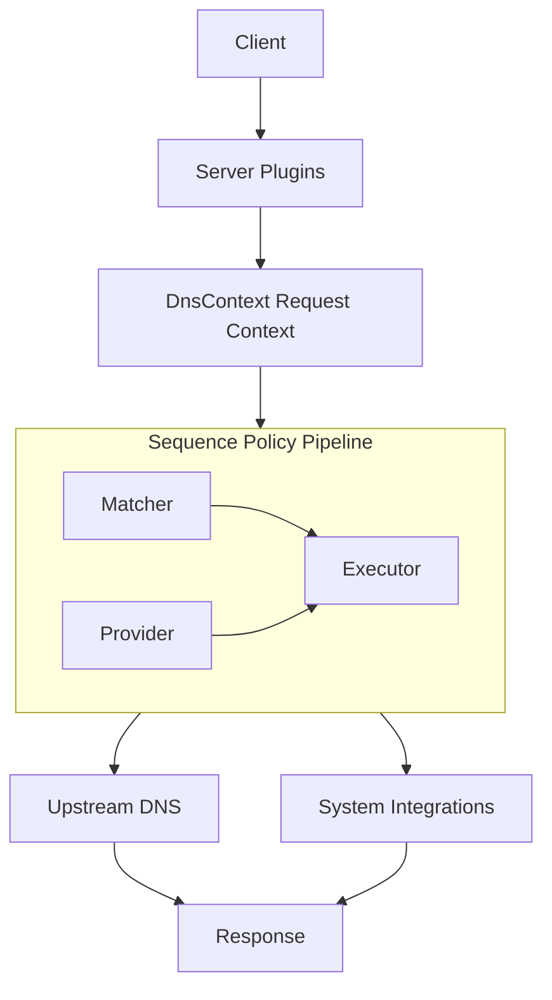

This page explains the OxiDNS Next request path, plugin layering, and performance boundaries. It is intended as background for configuration design, policy composition, and troubleshooting.

## Core Request Path

OxiDNS Next is organized around this path:

`server -> DnsContext -> matcher / executor / provider -> upstream or side effects -> response`

- `server`
  - Accepts UDP, TCP, DoT, DoQ, and DoH traffic.
- `DnsContext`
  - Carries the query, response, metadata, and policy state for one request.
- `matcher`
  - Evaluates branch conditions.
- `executor`
  - Performs forwarding, cache access, fallback, rewrites, local answers, and integrations.
- `provider`
  - Supplies reusable domain/IP datasets.

## Why This Layering

OxiDNS Next avoids scattering policy logic across listeners or transports. It centralizes decision making in the policy layer for several reasons:

- The hot path is shorter and easier to optimize.
- Features compose naturally across protocols.
- New capabilities fit better as plugins than as transport-specific special cases.
- Configuration remains stable and predictable as policy complexity grows.

## Design Priorities

### 1. Performance Before Feature Accumulation

The target is not to pile up switches. The target is to keep complex policies operationally predictable.

- Keep the hot path short.
- Avoid repeating work per request.
- Reuse upstream connections and transport state.
- Move observability and side effects away from the most latency-sensitive path.

### 2. Policy as a First-Class Capability

OxiDNS Next is not just a forwarder. It is a composable policy engine.

- `sequence` orders execution.
- `matcher` determines branch conditions.
- `executor` performs actions.
- `provider` shares datasets.

This is easier to evolve than embedding rule logic into listeners or upstream modules.

### 3. System Integration Is Part of the Architecture

DNS answers can also drive:

- `ipset`
- `nftset`
- MikroTik route sync
- reverse lookup caches

That is why side-effect isolation and post-response execution are treated as architectural concerns, not bolt-ons.

## Why OxiDNS Next Uses Its Own DNS Message Layer

OxiDNS Next keeps its own DNS model and wire codec instead of building the full path on top of opaque third-party message objects.

Main reasons:

- Easier hot-path optimization
- Cleaner access to DNS semantics in policy code
- Tighter control over protocol correctness and server behavior

At a high level there are two layers:

- model layer: `Message`, `Name`, `Record`, `RData`
- wire layer: encode/decode, compression, length estimation, truncation, and RDATA rules

## Performance Principles

1. Keep listeners thin and route policy into `sequence`.
2. Do work at startup when possible, not per request.
3. Treat upstream connections as reusable resources.
4. Keep logging, metrics, and route sync off the critical path when correctness allows.
5. Respect TTL and negative-cache semantics.
6. Watch lock contention and shared-state growth.
