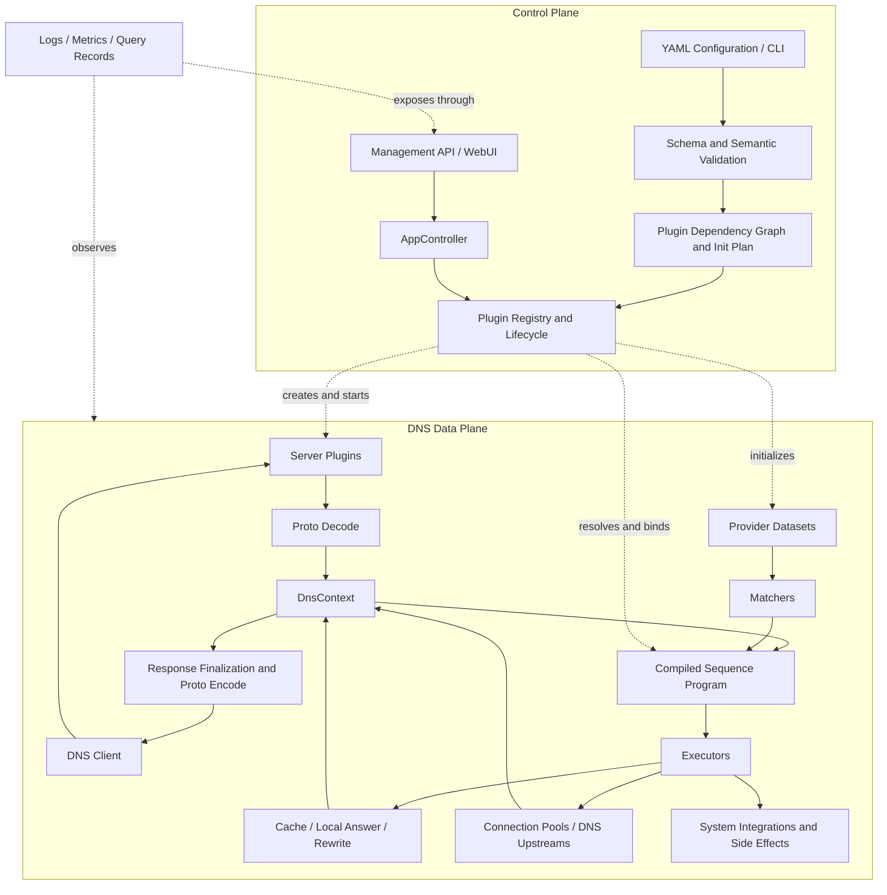

OxiDNS Next is a DNS policy orchestration engine for complex networks. Instead of placing protocol handling, caching, forwarding, and rule evaluation in one request function, it separates the data plane, control plane, policy layer, and infrastructure layer, then connects them through one request context.

This chapter reflects the current repository. It answers four questions: how a query moves through the system, why modules have their current boundaries, where performance work is applied, and which capabilities make OxiDNS Next distinctive.

## Architecture Goals

The architecture is designed around these goals:

- **Decouple protocols from policy**: UDP, TCP, DoT, DoQ, and DoH all enter the same policy pipeline.
- **Compose complex policies**: matching, execution, shared datasets, and control flow have separate models instead of becoming transport branches.
- **Keep the hot path optimizable**: configuration parsing, dependency analysis, policy compilation, and connection setup move to initialization whenever possible.
- **Preserve DNS semantics**: cache, concurrent forwarding, truncation, and negative responses optimize for correctness as well as speed.
- **Make execution explainable**: configuration graphs, execution paths, logs, metrics, health checks, and build capabilities provide operational visibility.
- **Govern side effects**: routing tables, address sets, downloads, and scripts remain clearly separated from DNS response generation.

## System Overview

The project has a data plane and a control plane. The data plane processes DNS requests. The control plane owns configuration, lifecycle, management APIs, and observability. They share runtime state without putting HTTP or service-management logic into the DNS policy hot path.

```mermaid
flowchart TB
    subgraph CP[Control Plane]
        CFG[YAML Configuration / CLI] --> VALID[Schema and Semantic Validation]
        VALID --> GRAPH[Plugin Dependency Graph and Init Plan]
        GRAPH --> REG[Plugin Registry and Lifecycle]
        API[Management API / WebUI] --> APP[AppController]
        APP --> REG
    end

    subgraph DP[DNS Data Plane]
        CLIENT[DNS Client] --> SERVER[Server Plugins]
        SERVER --> CODEC[Proto Decode]
        CODEC --> CTX[DnsContext]
        CTX --> PROGRAM[Compiled Sequence Program]
        PROVIDER[Provider Datasets] --> MATCHER[Matchers]
        MATCHER --> PROGRAM
        PROGRAM --> EXEC[Executors]
        EXEC --> LOCAL[Cache / Local Answer / Rewrite]
        EXEC --> UPSTREAM[Connection Pools / DNS Upstreams]
        EXEC --> EFFECT[System Integrations and Side Effects]
        LOCAL --> CTX
        UPSTREAM --> CTX
        CTX --> FINALIZE[Response Finalization and Proto Encode]
        FINALIZE --> CLIENT
    end

    REG -. creates and starts .-> SERVER
    REG -. resolves and binds .-> PROGRAM
    REG -. initializes .-> PROVIDER
    OBS[Logs / Metrics / Query Records] -. observes .-> DP
    OBS -. exposes through .-> API
```

The core data path can be summarized as:

`server -> DnsContext -> compiled sequence -> matcher / executor / provider -> response or side effects`

## How a DNS Request Executes

### 1. Protocol ingress and message decoding

`src/plugin/server/` accepts UDP, TCP, DoT, DoQ, and HTTP DNS traffic. Server plugins own listeners, connections, protocol metadata, and I/O; they do not contain routing policy. DNS wire data is decoded by the standalone `crates/proto` crate into OxiDNS Next's own `Message` model.

Every protocol ultimately calls the same `RequestHandle`. Adding a matcher, cache rule, or rewrite therefore does not require separate changes to UDP, QUIC, and HTTP servers.

### 2. Create one `DnsContext`

Each request receives a `DnsContext`, the only request-lifecycle object the policy layer needs to understand.

| Area | Content | Purpose |
| --- | --- | --- |
| `ingress` | Client address, SNI/server name, HTTP URL path | Carries ingress metadata |
| `request` | Current DNS request | Read by matchers and mutated by executors |
| `response` | Optional DNS response | Produced by cache, upstreams, or local answers |
| `runtime` | Marks and type-safe request-local extensions | Passes temporary state between plugins |
| `execution_path` | Optional structured execution events | Query recording and policy diagnosis |

State remains request-local rather than being stored in global shared objects.

### 3. Enter the compiled policy program

A server's `entry` references an executor, normally `sequence`. Sequence does not parse YAML for every request. During plugin initialization it:

- resolves `$plugin_tag` and quick-setup expressions into concrete plugin references;
- binds matcher lists and executors to instructions;
- compiles `accept`, `return`, `reject`, `jump`, `goto`, and `mark` into built-in operations; and
- produces a flat, program-counter-driven `ChainProgram`.

At request time the engine reads instructions, evaluates matchers, and advances through `ExecStep::Next / Stop / Return`. Plugins that wrap downstream execution use the continuation model to run logic before and after the rest of the chain. Cache and fallback behavior can therefore compose without a separate special-purpose pipeline.

### 4. Produce a response or a side effect

An executor may:

- answer directly from cache, hosts, arbitrary records, or response templates;
- query one or more upstreams through `forward`;
- modify the request, EDNS/ECS, TTLs, response records, or marks;
- trigger `ipset`, `nftset`, MikroTik, HTTP, script, or recording side effects; or
- continue, stop the current sequence, or return to the calling sequence.

Providers do not handle network traffic. They expose reusable domain, IP, Geo, and AdGuard datasets to matchers and executors so multiple rules do not load duplicate copies.

### 5. Finalize the response once

`RequestHandle` applies the same response and error behavior to every protocol:

- executor errors produce `SERVFAIL`;
- natural completion without a response produces an empty `NOERROR`;
- recursion-available is set consistently, and EDNS is added when the request carried EDNS;
- UDP responses are encoded and truncated to the payload limit, while TCP and encrypted protocols use their framing rules.

Policy plugins do not need to duplicate server-level protocol fallback behavior.

## Plugin Model

OxiDNS Next has four plugin categories. A category defines lifecycle and dependency semantics, not merely a source directory.

| Category | Responsibility | Representative implementations |
| --- | --- | --- |
| `server` | Accept a protocol and pass requests to an entry executor | `udp_server`, `tcp_server`, `quic_server`, `http_server` |
| `executor` | Read or mutate context, produce answers, control flow, or cause side effects | `sequence`, `forward`, `cache`, `fallback`, `ttl` |
| `matcher` | Evaluate predicates over queries, responses, clients, and runtime state | `qname`, `client_ip`, `resp_ip`, `rcode`, `rate_limiter` |
| `provider` | Load and maintain reusable rule data | `domain_set`, `ip_set`, `geoip`, `geosite`, `adguard_rule` |

Factories register through proc-macros and `inventory`, so the central registry does not maintain an ever-growing handwritten type switch. Factories also declare dependencies, allowing configuration validation and runtime initialization to share one plugin catalog and dependency model.

### Dependency graph and lifecycle

Startup is not a sequence of constructors in YAML order:

1. Reject duplicate tags and unknown plugin types.
2. Analyze references and reject missing dependencies, type mismatches, self-references, and cycles.
3. Compute the live set from non-provider plugins and skip providers with no consumers.
4. Run startup preparation in source order, for example downloading files required by providers.
5. Create, initialize, and publish plugins in topological order.
6. Destroy them in reverse initialization order so dependents stop before dependencies.

This exposes failures before listeners are opened and allows plugins to depend on declared capabilities rather than accidental configuration order.

## Code Boundaries

| Module | Primary responsibility | Responsibility kept out |
| --- | --- | --- |
| `src/main.rs` | Binary entry and top-level command dispatch | Plugin business logic and networking |
| `src/cli/` | CLI arguments, output, and runtime adapters | DNS request processing |
| `src/app/` | Startup, reload, rollback, restart, and graceful shutdown orchestration | Concrete plugin behavior |
| `src/config/` | YAML, includes, environment expansion, typed schema, validation | Opening network connections |
| `src/api/` | Management, health, control, logs, metrics, and plugin HTTP routes | Data-plane policy decisions |
| `src/core/` | `DnsContext`, response classification, reusable rule-matching primitives | I/O and plugin registration |
| `src/plugin/` | Four plugin categories, factories, dependency graph, registry, category-local code | Generic network and system infrastructure |
| `src/infra/` | Networking, cache primitives, task center, observability, service, upgrade, generic I/O | Matcher/executor/provider semantics |
| `crates/proto/` | DNS model, RDATA, and wire codec | Runtime policy |
| `crates/macros/` | Plugin registration proc-macros | Runtime state |
| `crates/ripset/` | Linux ipset/nftset netlink implementation | DNS policy orchestration |
| `crates/zoneparser/` | Zone-file parsing | Plugin lifecycle |

The important dependency direction is `plugin -> core / infra / proto`. Code moves into `infra` only when it contains no plugin semantics and is reusable across subsystems. Plugin traits, registries, and plugin-specific models do not flow back into infrastructure.

## Network and Upstream Architecture

### Separate ingress and egress

Servers decide how queries arrive; upstreams decide how queries leave. They share message and transport infrastructure but have independent configuration and lifecycle. `network.outbound` additionally centralizes resolver and SOCKS5 policy for process-owned outbound traffic, avoiding separate network policy implementations for downloads, upgrades, HTTP side effects, and DNS upstreams.

Protocol features follow the same responsibility split:

- `server-*`: inbound DoT/DoH/DoQ/DoH3;
- `upstream-*`: DNS upstreams used by `forward` and related paths;
- `resolver-*`: `network.outbound.resolver.nameservers`.

### Two connection-pool models

The network layer selects a reuse model based on protocol capabilities:

| Model | Typical path | Implementation focus |
| --- | --- | --- |
| Pipeline pool | UDP, DoQ, DoH2/3, and TCP/DoT with pipeline enabled | Multiple requests per connection, atomic inflight counts, `ArcSwap` connection snapshots, load-aware slot selection |
| Reuse pool | Default TCP/DoT and TCP fallback after UDP truncation | One borrowed request per connection, `ArrayQueue` returns, bounded connection count |

Both pools support minimum and maximum sizes, idle cleanup, demand expansion, and background prefill. One `QueryDeadline` covers acquisition, connection setup, and response wait. After a timeout, the pool reuses, retires, or closes the connection according to protocol safety instead of restarting a full timeout at every layer.

Pipelined connections use a bounded sparse request map sized for expected concurrency. It stores only active DNS IDs and waiters instead of allocating the full 65,536-ID space for every connection. Atomic slot states handle correlation, while an RAII guard cleans up completed or cancelled requests.

When a UDP upstream returns TC, OxiDNS Next moves to the TCP fallback pool within the same deadline budget. Domain-based upstreams use the bootstrap resolver and its TTL-aware address cache; an address change refreshes the connection pool instead of forcing every request to resolve and reconnect.

### Concurrent forwarding is more than first-response-wins

`forward` can query multiple upstreams concurrently, but selection distinguishes positive answers, NXDOMAIN, NODATA, incomplete CNAME chains, and other responses. Current modes are:

- `fastest`: the first valid DNS response wins;
- `balanced`: positive answers return immediately, while negative answers get a short grace period;
- `prefer_positive`: wait for other attempts and prefer a positive answer;
- `consensus`: require matching negative votes before accepting a negative answer.

This addresses a common concurrent-DNS problem: the fastest negative response is not necessarily the most trustworthy response.

## Owned DNS Message Layer

`crates/proto` is a standalone crate that owns `Message`, `Name`, `Record`, `RData`, and the wire codec. The value of an owned message layer is not merely removing a dependency. It lets protocol semantics and hot-path work evolve together:

- `Name` shares immutable data through `Arc` and uses `SmallVec` for common short names and label offsets;
- EDNS and related structures use copy-on-write, so cloning a message does not immediately deep-copy all content;
- encoders append directly into reusable buffers and support wire-ID replacement, name compression, size estimation, and payload limits;
- UDP limited encoding rolls back at RR boundaries, sets TC, and preserves correct EDNS trailer and compression behavior;
- the decoder explicitly rejects out-of-bounds, cyclic, and excessively deep compression pointers.

The trade-off is ownership of more DNS types and compatibility tests. Keeping `proto` independent from policy code limits the blast radius of protocol maintenance.

## Cache Architecture

The cache executor builds on the concurrent TTL primitive in `src/infra/cache/ttl.rs`, while DNS-specific semantics stay in the plugin layer.

### Correctness

- Keys include normalized qname, qtype, qclass, DO, CD, and optionally an ECS scope masked to its prefix.
- Positive caching uses answer TTLs with optional minimum and maximum policies.
- NXDOMAIN and NODATA derive negative TTL from SOA, with a configurable fallback when SOA is absent.
- Truncated responses and incomplete alias answers are not admitted.
- Hits restore the current request ID and age record TTLs by elapsed time.

### Concurrency and capacity

- `DashMap + AHash` shards reads and writes.
- Hits do not update LRU time on every access; the touch interval adapts to cache size and occupancy.
- Expiration scans, sampled LRU, and high/low-watermark batch eviction avoid sorting the entire map in a request.
- Most cleanup runs through the shared TaskCenter; insertion performs only bounded inline maintenance.

### Lazy cache and persistence

With lazy cache enabled, an entry can serve a stale answer briefly after its fresh TTL while a continuation refreshes it in the background. An inflight set deduplicates refreshes for the same key, and identity checks prevent an older refresh from overwriting a newer value.

An optional dump file restores entries at startup and writes asynchronously according to change and time thresholds. Persistence is a recovery capability and is not part of the normal cache-hit path.

## Where Performance Work Lives

Performance work is distributed across the request lifecycle rather than concentrated in one “high-performance module.”

| Layer | Current implementation | Main benefit |
| --- | --- | --- |
| Policy | Compile Sequence into a flat instruction stream at initialization | Avoid expression parsing and control-flow discovery per request |
| Message | `Arc`, copy-on-write, `SmallVec`, direct append encoding | Reduce message-clone and short-object allocation cost |
| UDP I/O | Global fixed-capacity wire-buffer pool with RAII return | Reduce short-lived `Vec` allocations |
| TCP I/O | Reusable reader/writer frame buffers; owned halves for plain TCP | Reduce growth and avoid an unnecessary shared I/O lock |
| Connection pools | `ArcSwap + atomics` for Pipeline; `ArrayQueue` for Reuse | Reduce contention during selection and return |
| Correlation | Bounded sparse lock-free request map | Preserve the DNS ID space with controlled per-connection memory |
| Cache | Sharded map, adaptive touches, batched expiry, sampled LRU | Control write amplification and long-tail pauses at high hit rates |
| Scheduling | One TaskCenter with a deadline heap for periodic jobs | Reduce one-ticker-per-plugin resident task overhead |
| Observability | Atomic counters and pull collection; level checks before debug formatting | Avoid detailed-observability cost when disabled |
| Build | Cargo features remove protocols, APIs, and optional plugins | Reduce binaries, dependencies, and runtime surface on small systems |

The project also exposes `hotpath` and `hotpath-alloc` features for measuring function time and allocation sites instead of optimizing by intuition. See [Performance and Benchmarks](benchmarks.md) for reproducible methodology and historical results.

## What Makes OxiDNS Next Distinctive

### 1. Depth of policy orchestration

The central strength is not the number of plugins. Matcher, executor, provider, sequence, quick setup, jump/goto, and continuations form a complete execution model. A capability can remain reusable as a plugin while participating in complex policies without turning a listening protocol into a business-logic entry point.

### 2. DNS-result semantics are first-class

Cache, fallback, concurrent forwarding, and resolver logic share response classification concepts and explicitly distinguish positive, negative, empty, and incomplete CNAME results. TTL, SOA, EDNS, ECS, TC, and request IDs remain correctness constraints rather than incidental fields on the first `Message` received.

### 3. Protocol breadth comes with connection depth

OxiDNS Next covers UDP/TCP, DoT, DoH2, DoH3, and DoQ while also providing shared infrastructure for bootstrap, proxies, pooling, pipelining, deadlines, UDP-to-TCP fallback, and resolver caches. Protocol support is not a collection of isolated clients.

### 4. DNS can drive the surrounding network

Answers can update `ipset`, `nftset`, MikroTik address lists/routes, reverse-lookup caches, and dynamic domain sets. Shared RouterOS components cover batching, throttling, leases, reconciliation, and mailboxes, giving external synchronization lifecycle and backpressure awareness instead of issuing an ad hoc remote call inside the request function.

### 5. An operable and diagnosable runtime

The project provides static configuration checks, dependency graphs, health/readiness endpoints, build-capability reporting, Prometheus metrics, live logs, query summaries, query records, provider reload, full reload, restart, and upgrade. Maintainers can diagnose complex policies through configuration, execution paths, plugin metrics, and process state.

### 6. One codebase can be tailored instead of forked into products

`minimal`, `standard`, `full`, and granular features share the same source. Small routers can remove APIs, WebUI, encrypted protocols, or heavy plugins, while complete installations retain them. Feature-gating tests ensure a missing capability produces a clear error rather than failing in a deep runtime branch. See [Custom Build](custom-build.mdx).

## Control Plane, Reload, and Failure Boundaries

The control plane consists of `AppController`, the optional management API, and the application event loop. APIs request reload, restart, or shutdown; `src/app/` serializes the actual lifecycle transition so an HTTP handler never mutates the global runtime concurrently.

Configuration loading processes includes, YAML deserialization, environment expansion, schema validation, and dependency analysis. The current full-reload flow is:

1. Validate the candidate first; a validation failure leaves the current runtime untouched.
2. Stop the old API and plugin runtime, then stop jobs managed by the TaskCenter.
3. Assemble the candidate configuration.
4. If assembly fails, rebuild the runtime from the saved previous configuration.

Full reload therefore provides recovery on failure, but it is not a strictly zero-downtime swap; a short interruption can occur while the runtime is rebuilt. Prefer provider-level reload when only rule data changes, because it does not destroy the complete plugin graph.

## Design Boundaries and Trade-offs

- **Composability creates configuration complexity**: as policies grow, use configuration validation, dependency graphs, and execution recording instead of inferring behavior from YAML alone.
- **Concurrent forwarding amplifies traffic**: `concurrent` exchanges extra queries for latency and reliability; select concurrency and response mode with upstream limits in mind.
- **Side effects need deliberate placement**: scripts, HTTP requests, route synchronization, and persistence can block or fail. Use mailboxes or background tasks when an operation can be dispatched asynchronously. A continuation can commit or clean up after downstream policy, but it still runs before the wire response is sent and is not automatic asynchronous isolation.
- **An owned protocol layer requires continuous verification**: it creates optimization and control opportunities, but new RR types, compression rules, and boundary behavior require tests.
- **Feature trimming changes runtime capabilities**: configuration must match the binary's feature and plugin catalog; use `oxidns-next build-info` or `/api/build` as supporting evidence.

These boundaries are not hidden costs. They are explicit constraints to manage when deploying and evolving the system.

## Further Reading

- [Plugin Overview](plugin-reference/overview.md): plugin categories and navigation
- [Configuration](configuration.md): runtime schema and networking
- [Management API](api.mdx): control plane, health, and metrics
- [Performance and Benchmarks](benchmarks.md): reproducible data and analysis
- [Custom Build](custom-build.mdx): bundles and feature trimming
